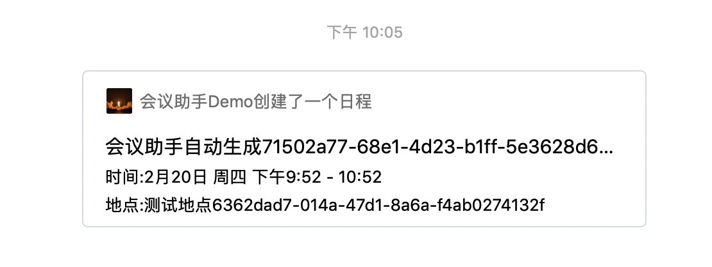

# 企业微信 Java SDK

## Usage
### 1、Add dependency
``` java
<dependency>
    <groupId>com.github.guodont</groupId>
    <artifactId>qy-wechat-sdk</artifactId>
    <version>0.0.1-SNAPSHOT</version>
</dependency>

```

### 2、Configuration

``` java
@Configuration
@Data
public class CorpWechatConfig {

    @Value("${corp.wechat.corpId}")
    private String corpId;

    @Value("${corp.wechat.secret}")
    private String secret;

    @Value("${corp.wechat.agentId}")
    private String agentId;

    @Bean
    public CorpWeChatService corpWeChatService() {
        return new CorpWeChatService(corpId, secret, agentId);
    }
}

```

### 3、Invoke in java code

``` java
    CorpWeChatService corpWeChatService = new CorpWeChatService("wx0694d8e24e0aacf1", "", "1000032");
    ScheduleBean scheduleBean = new ScheduleBean();
    List<ScheduleBean.AttendeesBean> attendeesBeans = new ArrayList<ScheduleBean.AttendeesBean>();
    scheduleBean.setSummary("会议助手自动生成"+ UUID.randomUUID().toString());
    scheduleBean.setDescription(UUID.randomUUID().toString());
    scheduleBean.setOrganizer("guodong");
    scheduleBean.setLocation("测试地点" + UUID.randomUUID().toString());
    scheduleBean.setStart_time(1582206749);
    scheduleBean.setEnd_time(1582210348);
    ScheduleBean.AttendeesBean user1 = new ScheduleBean.AttendeesBean();
    ScheduleBean.AttendeesBean user2 = new ScheduleBean.AttendeesBean();
    user1.setUserid("guodong");
    user2.setUserid("xiexuhua");
    attendeesBeans.add(user1);
    attendeesBeans.add(user2);
    scheduleBean.setAttendees(attendeesBeans);
    corpWeChatService.addSchedule(scheduleBean);
```

### 4、showcase


